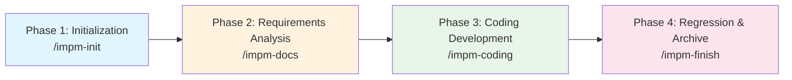

<div align="center">

# 🤖 opencode-impm

**I am the Project Manager — an AI-driven, engineering-grade full-lifecycle development suite**

<p>
  <a href="#"></a>
  <a href="./LICENSE"></a>
  <a href="https://nodejs.org/">=%2018-339933?style=flat-square&logo=node.js&logoColor=white" alt="node"></a>
  <a href="https://opencode.ai/"></a>
</p>

<p><i>Built on the OpenCode platform with the "AI Project Manager" at its core, it orchestrates 13 professional Agents through a waterfall-style four-phase workflow to complete the entire software development lifecycle.</i></p>

[🚀 Quick Start](#-quick-start) · [📖 Usage Documentation](#-usage-documentation) · [📂 Project Structure](#-project-structure) · [❓ FAQ](#-faq)

</div>

---

## 📋 Table of Contents

- [Core Features](#-core-features)
- [Architecture Overview](#-architecture-overview)
- [Quick Start](#-quick-start)
- [Installation](#-installation)
- [Configuration](#-configuration)
- [Usage Documentation](#-usage-documentation)
  - [Four-Phase Workflow](#four-phase-workflow)
  - [Standard Document Paths](#standard-document-paths)
  - [Complete Command List](#complete-command-list)
- [Project Structure](#-project-structure)
- [Contribution Guide](#-contribution-guide)
- [FAQ](#-faq)
- [License](#-license)
- [Appendix](#-appendix)

---

## ✨ Core Features

| Feature | Description |
|:---:|:---|
| 🎭 | **AI Project Manager Orchestration** — uniformly dispatches 13 professional Agents: BA / SA / TL / DBA / TE / SCM / DW / CS / WS / FEE / BEE / SSE |
| 📋 | **4 Phases, 46 Skills** — every phase runs strictly in order: no skipping, no out-of-order execution, no parallelism |
| 🧪 | **Test-Driven Development (TDD)** — test cases are written before coding, tests are executed after coding, and code is committed only when everything passes |
| 📁 | **Version-Based Management** — each version gets its own directory `docs/{project abbreviation}-v{version}/` plus a dedicated Git branch |
| 📝 | **All-English Workflow** — documents, comments, and reports are all written in English |
| 🔌 | **14 Plugin Tools** — document read/write, version management, task scheduling, Git operations, prompt recording and export, etc. |

---

## 🏗️ Architecture Overview

```
┌─────────────────────────────────────────────────────────────┐
│                        🤖 PM Project Manager                 │
│              (orchestrates and dispatches, does no hands-on work)│
└─────────────┬───────────────────────────────────────────────┘
              │ dispatch tasks
    ┌─────────┼─────────┬─────────┬─────────┐
    ▼         ▼         ▼         ▼         ▼
 ┌─────┐  ┌─────┐  ┌─────┐  ┌─────┐  ┌─────┐
 │ BA  │  │ SA  │  │ TL  │  │ DBA │  │ TE  │
 │Bus. │  │Sys. │  │Tech │  │DB   │  │Test │
 │Anal.│  │Arch.│  │Lead │  │Arch.│  │Eng. │
 └─────┘  └─────┘  └─────┘  └─────┘  └─────┘
 ┌─────┐  ┌─────┐  ┌─────┐  ┌─────┐  ┌─────┐  ┌─────┐  ┌─────┐
 │ SCM │  │ DW  │  │ CS  │  │ WS  │  │ SSE │  │ FEE │  │ BEE │
 │Conf.│  │Doc. │  │Code │  │Web  │  │Sr.  │  │Front│  │Back │
 │Mgmt │  │Writ.│  │Sear.│  │Sear.│  │Eng. │  │End  │  │End  │
 └─────┘  └─────┘  └─────┘  └─────┘  └─────┘  └─────┘  └─────┘

 ═══════════════════════════════════════════════════════════════
  Phase 1       Phase 2       Phase 3       Phase 4
  Init ──────▶  Requirements ──▶ Coding ──▶  Regression & Archive
 ═══════════════════════════════════════════════════════════════
```

---

## 🚀 Quick Start

### One-Key Startup (Recommended)

In OpenCode, enter:

```bash
/impm
```

The PM Agent automatically guides you through all four phases of development.

### Manual Execution Per Phase

| Phase | Command | Description |
|:----:|:-----|:-----|
| 1 | `/impm-init` | Initialize the project; generate URS/PRD/SAD/DBD/API/LLD/task list/test cases |
| 2 | `/impm-docs` | Confirm the version requirements; update the design documents; create the task list |
| 3 | `/impm-coding` | Loop through tasks: context → coding → tests → commit |
| 4 | `/impm-finish` | Regression testing, code review, document merging, merge the main branch |

> 💡 **Tip**: when running manually you can monitor each step's result, modify requirements if necessary, or roll back Git and re-run. Each project has its own Git branch, and commits are made automatically at the end of each phase.

---

## 📦 Installation

### Environment Requirements

- [Node.js](https://nodejs.org/) >= 18
- [OpenCode](https://opencode.ai/) (a version that supports plugins, skills, and commands)

### Method 1: Local Installation (⭐ Recommended for development/debugging)

```bash
# Clone the project
git clone <repository-url>
cd opencode-impm

# Install dependencies (postinstall automatically runs the install script)
npm install

# Compile the TypeScript source
npm run build

# Install into a target project
node scripts/install.mjs --target /path/to/project
# Windows PowerShell users:
# .\scripts\install.ps1 -Target D:\path\to\project
```

### Method 2: Install as an npm Dependency

```bash
npm install opencode-impm
```

### Verify Installation

Restart OpenCode after installation; typing `/impm` shows the PM Agent's welcome message.

---

## ⚙️ Configuration

The install generates the following structure automatically in the target project:

```
project root/
├── .opencode/
│   ├── agents/              # 13 AI Agent definitions
│   ├── commands/            # 46 command definitions
│   ├── skills/              # 46 skills and templates
│   └── plugins/impm/        # compiled plugin entry
└── opencode.json            # OpenCode configuration file
```

**Minimal configuration example** (usually handled automatically by the install script; no manual editing required):

```json
{
  "plugins": [
    {
      "name": "impm",
      "entry": ".opencode/plugins/impm/index.js"
    }
  ]
}
```

---

## 📖 Usage Documentation

### Four-Phase Workflow



| Phase | Command | Core Actions |
|:----:|:-----|:---------|
| **1** | `/impm-init` | Determine the project type → create the version directory and progress table → generate all initial documents → commit |
| **2** | `/impm-docs` | Confirm the version requirements → create the version branch → generate/update URS/PRD/SAD/DBD/API/LLD → create the task list |
| **3** | `/impm-coding` | Loop through the task list: collect context → code search → web search → database/API design → test cases → coding → write tests → run tests → commit |
| **4** | `/impm-finish` | Full regression tests → add comments → code review → update the project map → merge documents → update README/Agent/deployment docs → merge the main branch |

### Standard Document Paths

| Document Type | Path |
|:---------|:-----|
| Project basic information | `docs/project.md` |
| System architecture design | `docs/sad.md` |
| Version directory | `docs/{project abbreviation}-v{version}/` |
| Version requirement/design documents | `docs/{abbreviation}-v{version}/{abbreviation}-{urs\|prd\|dbd\|api\|lld\|testcase}-v{version}.md` |
| Database scripts | `docs/{abbreviation}-v{version}/{abbreviation}-dbd-v{version}.sql` |
| Task list | `docs/{abbreviation}-v{version}/{abbreviation}-task-v{version}.json` |
| Version progress table | `docs/{abbreviation}-v{version}/version_progress.md` |
| Prompt records | `docs/prompts/prompts.md` |
| Build/deployment plans | `deploy/build.md`, `deploy/deploy.md` |

### Complete Command List

<details>
<summary>📋 Click to expand the 46 commands (grouped by phase)</summary>

#### Overall Workflow

| Command | Description |
|:-----|:-----|
| `/impm` | I am the Project Manager: orchestrate the full four-phase workflow |

#### Phase 1: Initialization

| Command | Description | Executing Agent |
|:-----|:-----|:----------:|
| `/impm-init` | Orchestrate all steps of the initialization phase | PM |
| `/impm-init-isinit` | Determine whether the project is initialized and whether it is an empty project | PM |
| `/impm-init-git` | Initialize the git repository and create the first commit | SCM |
| `/impm-init-project` | Generate the project basic information `docs/project.md` | SA |
| `/impm-init-version` | Create the version directory and the version progress table | SA |
| `/impm-init-urs` | Generate the User Requirement Specification | BA |
| `/impm-init-prd` | Generate the Product Requirement Document | BA |
| `/impm-init-sad` | Generate the System Architecture Design document | SA |
| `/impm-init-dbd` | Generate the Database Design document and SQL scripts | DBA |
| `/impm-init-api` | Generate the API design document | SA |
| `/impm-init-lld` | Generate the Low-Level Design document | TL |
| `/impm-init-task` | Generate the task list (task JSON) | TL |
| `/impm-init-testcase` | Generate the test case document | TE |
| `/impm-init-commit` | Commit all deliverables of the initialization phase | SCM |

#### Phase 2: Requirements Analysis

| Command | Description | Executing Agent |
|:-----|:-----|:----------:|
| `/impm-docs` | Orchestrate all steps of the requirements analysis phase | PM |
| `/impm-version-create` | Determine the version number; create the version branch, version directory, and progress table | SCM |
| `/impm-urs-create` | Generate the User Requirement Specification (URS) | BA |
| `/impm-prd-create` | Generate the Product Requirement Document (PRD, including user stories and acceptance criteria) | BA |
| `/impm-sad-update` | Evaluate and update the System Architecture Design document (SAD) | SA |
| `/impm-dbd-create` | Generate the Database Design document (DBD) and SQL scripts | DBA |
| `/impm-api-create` | Generate the API design document | TL |
| `/impm-lld-create` | Generate the Low-Level Design document (LLD) | TL |
| `/impm-task-create` | Generate the task list (task JSON) | TL |
| `/impm-analysis-commit` | Commit all deliverables of the requirements analysis phase | SCM |

#### Phase 3: Coding Development

| Command | Description | Executing Agent |
|:-----|:-----|:----------:|
| `/impm-coding` | Orchestrate the coding development phase: loop through all tasks | PM |
| `/impm-task-coding` | Orchestrate the full coding workflow of a single task | PM |
| `/impm-task-coding-context` | Collect the task requirement context (context.md) | TL |
| `/impm-task-coding-cs` | Local code search (cs.md) | CS |
| `/impm-task-coding-ws` | Web resource search (ws.md) | WS |
| `/impm-task-coding-dbd` | Database change design | DBA |
| `/impm-task-coding-api` | API change design | TL |
| `/impm-task-coding-testcase` | Write the task test cases | TE |
| `/impm-task-coding-code` | Implement the feature code | SSE/FEE/BEE |
| `/impm-task-coding-writetest` | Write test functions and automated scripts | TE |
| `/impm-task-coding-runtest` | Run the tests and update the results | TE |
| `/impm-task-coding-gitcommit` | Commit the task code and update the task status | SCM |

#### Phase 4: Regression Testing and Version Documentation

| Command | Description | Executing Agent |
|:-----|:-----|:----------:|
| `/impm-finish` | Orchestrate all steps of Phase 4 | PM |
| `/impm-regression-test` | Regression tests (full unit tests + API tests) | TE |
| `/impm-coding-comment` | Add English comments to the version code | DW |
| `/impm-coding-review` | Code review (security, performance, quality, compliance, test coverage) | TL |
| `/impm-project-update` | Update the project map and `docs/project.md` | SA |
| `/impm-doc-merge` | Merge the version documents into the master documents | DW |
| `/impm-doc-update` | Update `readme.md` and `agent.md` | DW |
| `/impm-deploy-update` | Update the build/deployment plans (`deploy/build.md`, `deploy/deploy.md`) | DW |
| `/impm-git-merge` | Merge the version branch into the main branch | SCM |

</details>

---

## 📂 Project Structure

```
opencode-impm/
├── 📁 assets/                   # Suite assets (copied to .opencode/ on install)
│   ├── 📁 agents/               # 13 AI Agent definitions (.md)
│   ├── 📁 commands/             # 46 commands (.md)
│   └── 📁 skills/               # 46 skills (one directory per skill) + template/ templates
├── 📁 src/                      # Plugin source (TypeScript)
│   ├── 📁 tools/                # Implementation of the 14 tools (including prompt-recorder)
│   ├── 📁 utils/                # Path / version / git / project info utilities
│   └── 📄 index.ts              # Plugin entry point
├── 📁 scripts/
│   ├── 📄 install.mjs           # Install script (Node)
│   └── 📄 install.ps1           # Install script (Windows PowerShell)
├── 📁 docs/                     # Project documentation directory (auto-generated by the workflow)
├── 📄 opencode.json             # OpenCode configuration file
├── 📄 LICENSE                   # Apache License 2.0
├── 📄 readme.md                 # This document (maintained by impm-doc-update)
└── 📄 agent.md                  # Agent usage guide (maintained by impm-doc-update)
```

---

## 🤝 Contribution Guide

Issues and Pull Requests are welcome!

| Type | Requirements |
|:-----|:-----|
| 🐛 **Bug Reports** | Describe the reproduction steps and environment versions (Node.js / OpenCode / OS) |
| 💡 **Feature Suggestions** | Describe the use case and the expected behavior |
| 🔧 **Code Contributions** | Ensure existing tests pass and follow the existing code style |

---

## ❓ FAQ

<details>
<summary><b>Q1: The <code>/impm</code> command does not show up in OpenCode after installation?</b></summary>

Check that `impm*.md` files exist under `.opencode/commands/`, then restart OpenCode.
</details>

<details>
<summary><b>Q2: Is installation different on Windows and macOS?</b></summary>

The core logic is the same. Windows users can additionally install with `scripts/install.ps1`.
</details>

<details>
<summary><b>Q3: What if the OpenCode version is incompatible?</b></summary>

Make sure your OpenCode supports the plugin, skill, and command mechanisms. Upgrading to the latest version is recommended.
</details>

<details>
<summary><b>Q4: How do I debug the plugin?</b></summary>

Modify the source under `src/`, run `npm run build`, then re-run the install script.
</details>

---

## 📄 License

This project is licensed under the [Apache License 2.0](LICENSE).

```
Copyright 2026 jenemy8023 <jenemy8023@163.com>

Licensed under the Apache License, Version 2.0 (the "License");
you may not use this file except in compliance with the License.
You may obtain a copy of the License at

    http://www.apache.org/licenses/LICENSE-2.0
```

---

## 📎 Appendix

### Document Abbreviations

| Abbr. | Full Name | Description |
|:----:|:---------|:-----|
| **URS** | User Requirement Specification | Business goals, user roles, business scenarios, functional requirements (high level), non-functional requirements (high level), constraints, assumptions and dependencies |
| **PRD** | Product Requirement Document | Product background, target users, feature list, detailed feature descriptions, business flow diagrams, page prototypes, data requirements, acceptance criteria, version planning, appendix |
| **SAD** | System Architecture Design | Design goals and constraints, technology stack selection and rationale, system context diagram, container diagram, component diagram, deployment architecture diagram, security architecture, performance architecture, data flow diagram, architecture decision records |
| **DBD** | Database Design Document | Design goals, database selection, ER diagram (Mermaid), logical model, physical model, table structure definitions, index design, views/stored procedures/triggers design, data dictionary, backup & recovery strategy, security strategy |
| **API** | API Design Document | API list, API versioning strategy, authentication & authorization mechanisms, common error code definitions, detailed API definitions (URL/Method/Header/Body/Response), status code mapping, rate limiting strategy, example code |
| **LLD** | Low-Level Design Document | Module overview, module division and responsibilities, class diagram (Mermaid), core business process sequence diagrams (Mermaid), state diagrams, core business logic pseudocode/flowcharts, business rules and constraints, business data flow, data structure definitions, exception handling strategy, logging conventions, performance optimization points, unit test strategy |
| **TestCase** | Test Case Document | Case ID, case name, module, priority, preconditions, test steps, expected results, test data, related requirement ID, test type (functional/interface/performance/security) |

### Agent List

> PM is the main control Agent; the other 12 are Sub-Agents.

| Agent | Full Name | Role & Responsibilities |
|:-----:|:---------|:---------|
| **PM** | Project Manager | Main control Agent; does no hands-on work and dispatches Sub-Agents to execute |
| **BA** | Business Analyst | Collects requirements (URS) and translates business needs into clear, acceptable, traceable PRDs |
| **SA** | System Architect | System architecture design, project structure setup, and technical decisions; writes SAD |
| **TL** | Tech Lead | Detailed design and task list generation |
| **DBA** | Database Architect | Business modeling, relational databases, NoSQL, distributed databases, and performance optimization |
| **TE** | Test Engineer | Test cases, test functions, and automated test script writing |
| **SCM** | Software Configuration Management | Version management, change management, release management |
| **DW** | Document Writer | General technical document writing |
| **CS** | Code Searcher | Searches local code as requested |
| **WS** | Web Searcher | Queries official documentation, application examples, and technical materials |
| **SSE** | Senior Software Engineer | Handles complex business logic requirements |
| **FEE** | Front-End Engineer | Designs modern, aesthetically pleasing front-end pages |
| **BEE** | Back-End Engineer | Interface planning and back-end development |

### Skill-Agent Mapping

<details>
<summary>Phase 1: Initialization and Initialization Check</summary>

| Step | Skill | Sub-Agent |
|:---------|:-------|:------:|
| Whether the project is already initialized | `impm-init-isinit` | PM |
| Git initialization | `impm-init-git` | SCM |
| Project information file initialization | `impm-init-project` | SA |
| Version initialization | `impm-init-version` | SA |
| User requirement document initialization | `impm-init-urs` | BA |
| Product requirement document initialization | `impm-init-prd` | BA |
| System architecture design initialization | `impm-init-sad` | SA |
| Database design initialization | `impm-init-dbd` | DBA |
| API design initialization | `impm-init-api` | SA |
| Detailed design initialization | `impm-init-lld` | TL |
| Development task initialization | `impm-init-task` | TL |
| Test case, test function, and test script initialization | `impm-init-testcase` | TE |
| Commit the initialization documents | `impm-init-commit` | SCM |

</details>

<details>
<summary>Phase 2: Requirements and Design Analysis</summary>

| Step | Skill | Sub-Agent |
|:---------|:-------|:------:|
| Create the version directory | `impm-version-create` | SCM |
| Create the user requirement document for the current version | `impm-urs-create` | BA |
| Create the product requirement document for the current version | `impm-prd-create` | BA |
| Update the architecture design | `impm-sad-update` | SA |
| Create the database design for the current version | `impm-dbd-create` | DBA |
| Create the API design for the current version | `impm-api-create` | TL |
| Create the detailed design for the current version | `impm-lld-create` | TL |
| Create the development task list for the current version | `impm-task-create` | TL |
| Commit all previously generated documents | `impm-analysis-commit` | SCM |

</details>

<details>
<summary>Phase 3: Coding Development</summary>

| Step | Skill | Sub-Agent |
|:---------|:-------|:------:|
| Loop through the development task list and start coding | `impm-coding` | PM |
| Start the coding workflow for one specific task | `impm-task-coding` | PM |
| Collect the task-related requirements as context | `impm-task-coding-context` | TL |
| Search the existing code | `impm-task-coding-cs` | CS |
| Search related materials on the web | `impm-task-coding-ws` | WS |
| Adjust the database design per the task | `impm-task-coding-dbd` | DBA |
| Adjust the API design per the task | `impm-task-coding-api` | TL |
| Generate the test cases | `impm-task-coding-testcase` | TE |
| Select the appropriate engineer to complete the development | `impm-task-coding-code` | SSE/FEE/BEE |
| Write tests from the test cases and current code | `impm-task-coding-writetest` | TE |
| Run the tests; on failure, return to rewrite the code | `impm-task-coding-runtest` | TE |
| Commit to Git | `impm-task-coding-gitcommit` | SCM |

</details>

<details>
<summary>Phase 4: Regression Testing and Documentation Archiving</summary>

| Step | Skill | Sub-Agent |
|:---------|:-------|:------:|
| Regression testing | `impm-regression-test` | TE |
| Code comments | `impm-coding-comment` | DW |
| Code review | `impm-coding-review` | TL |
| Project map update | `impm-project-update` | SA |
| Merge the version documents into the master documents | `impm-doc-merge` | DW |
| Update readme.md and agent.md | `impm-doc-update` | DW |
| Update the build/deployment documents | `impm-deploy-update` | DW |
| Merge the current version branch into the main branch | `impm-git-merge` | SCM |

</details>

<!-- SPDX-License-Identifier: Apache-2.0 / Copyright 2026 jenemy8023 <jenemy8023@163.com> -->
